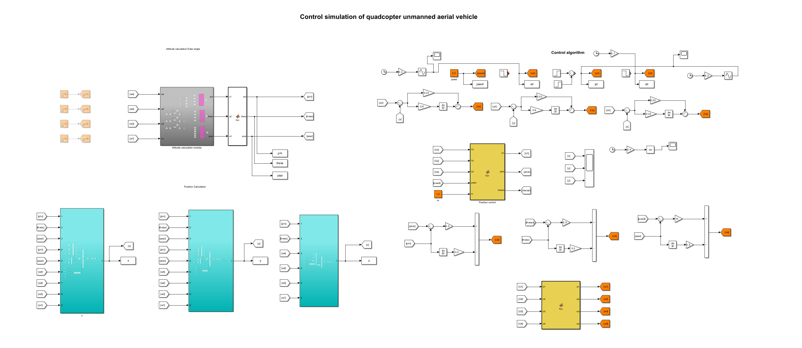
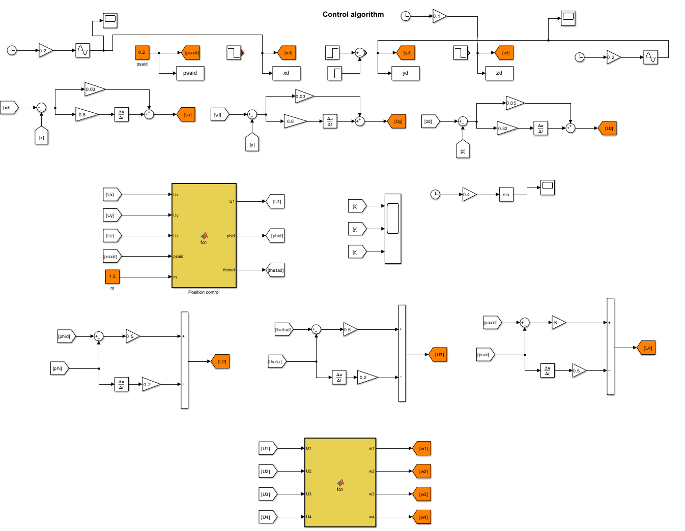
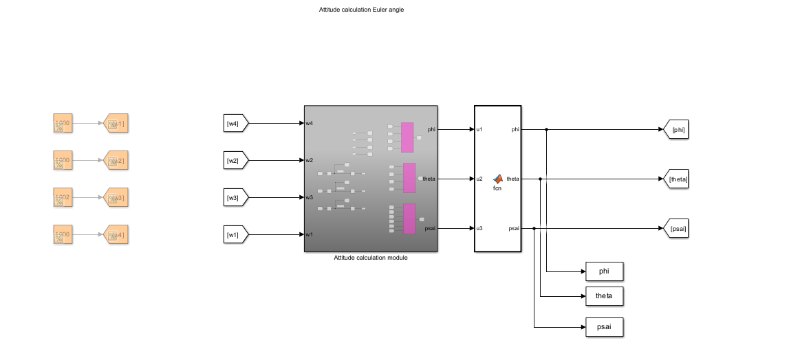
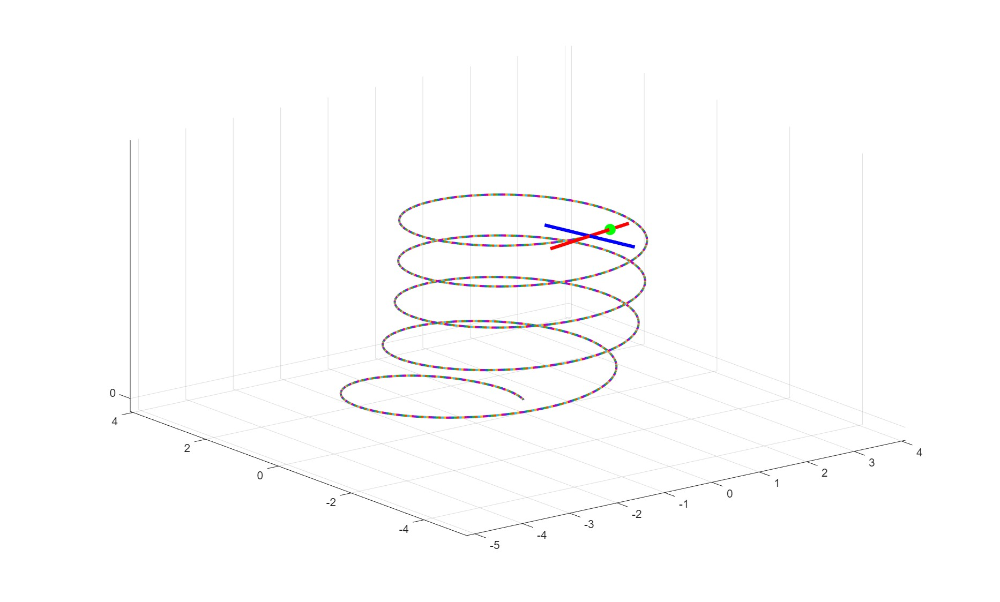

# Quadcopter UAV Control Simulation

This repository contains a complete MATLAB/Simulink project for simulating the flight dynamics and control of a 6-DOF Quadcopter Unmanned Aerial Vehicle (UAV). The project implements a cascade control strategy to track complex 3D trajectories (such as a spiral ascent).

## 📝 Overview

The simulation models the physics of a quadrotor, including rigid body dynamics, motor mixing, and environmental feedback. It utilizes a feedback control loop to adjust the rotor speeds ($w_1$ to $w_4$) based on the error between the desired trajectory and the current state.

### Key Features
*   **Full Dynamics Model:** Includes specific blocks for Attitude and Position integration.
*   **Cascade Control:** Separated loops for position tracking and attitude stabilization.
*   **3D Visualization:** A post-processing script animates the drone's orientation and path.
*   **Data Logging:** Real-time plotting of Euler angles and XYZ coordinates.

---

## 🏗️ System Architecture & Simulink Models

The system is built in **Simulink** (`demo.slx`). Below are the details of the internal subsystems.

### 1. Top-Level Simulation Model
This is the main simulation loop. It connects the Control Algorithm, the Quadcopter Plant (Dynamics), and the Reference Trajectory generation.


### 2. Control Algorithm
The controller takes the reference position ($x_d, y_d, z_d$) and current state, processes them through PID loops, and outputs the required motor mixing signals ($U_1, U_2, U_3, U_4$).


### 3. Attitude Calculation Module
This subsystem calculates the Euler angles ($\phi, \theta, \psi$) by integrating the angular rates, converting the body-frame angular velocities to the inertial frame.


### 4. Position Calculation Module
This block is responsible for integrating the linear accelerations and velocities to determine the drone's absolute position ($x, y, z$) in 3D space.


---

## 📊 Simulation Results

After running the simulation, the `run.m` script generates the following visualizations to validate performance.

### 1. 3D Trajectory Visualization
The drone (represented by the red/blue cross) successfully tracks a spiral climbing path. The green dot indicates the reference target.


### 2. Position Tracking Performance
Comparison between Reference Position (Red Dashed) and Actual Position (Blue Solid).
*   **X/Y:** Shows smooth sinusoidal tracking.
*   **Z:** Shows a linear altitude increase.


### 3. Attitude (Euler Angles) Response
The plots below show the Roll ($\phi$), Pitch ($\theta$), and Yaw ($\psi$) angles generated by the controller to execute the spiral maneuver.


---

## 🚀 How to Run

1.  **Clone the Repository:**
    ```bash
    git clone https://github.com/swzhangf/Quadcopter-UAV-Control-Simulation.git
    ```
2.  **Open MATLAB:**
    Ensure you have MATLAB and Simulink installed.
3.  **Run Simulation:**
    *   Open `demo.slx`.
    *   Click the **Run** button in Simulink.
    *   Wait for the simulation to finish (workspace variables like `tout`, `x`, `y` will be created).
4.  **Visualize:**
    *   Open `run.m`.
    *   Run the script to see the 3D animation and generate the plots.

## 📂 File List

*   `demo.slx`: Main Simulink model file.
*   `run.m`: Visualization and plotting script.
*   `drone.m`: Helper function for calculating the rotation matrix ($C_{bn}$) for 3D plotting.
*   `*.jpg`: Project documentation images.

## 📜 License

This project is open-source and available under the MIT License.

